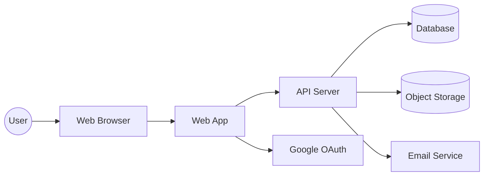

# システムコンテキスト

## コンテキスト図

## 境界と責務
- Web App: UI、エディタ表示、自動保存トリガー
- API Server: 認証、ノート/検索/共有/エクスポートAPI
- Database: メタデータ（User/Note/Notebook/Tag等）
- Object Storage: ノート本文・添付・PDF
- IdP: Google OAuthによる認証
- Email Service: パスワードリセット/通知メール

## 制約との整合
- 共有リンクは閲覧専用（PC-004）
- ユーザーごとのデータ分離（PC-003）
- 外部IdP・メール送信（PC-005/PC-006）
