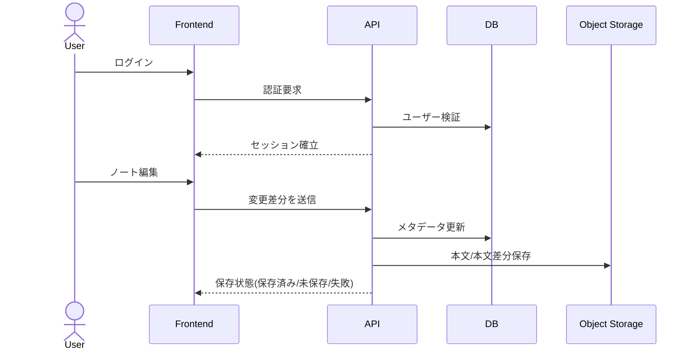
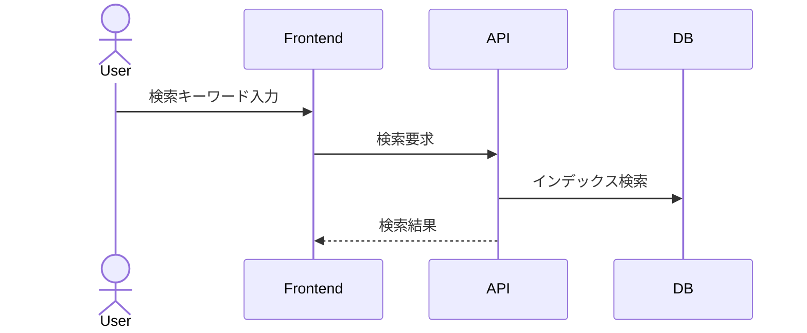
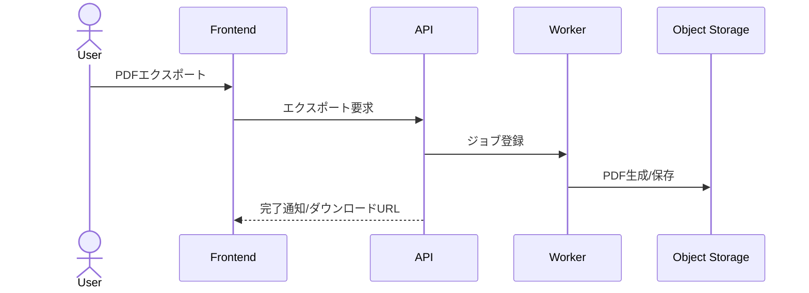
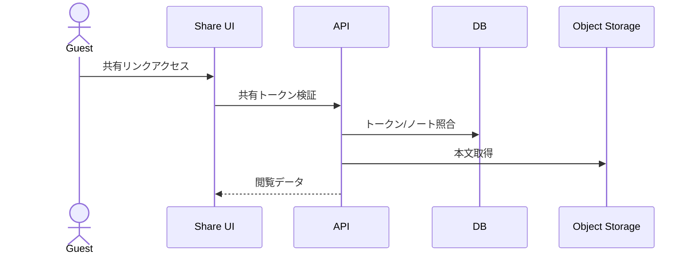
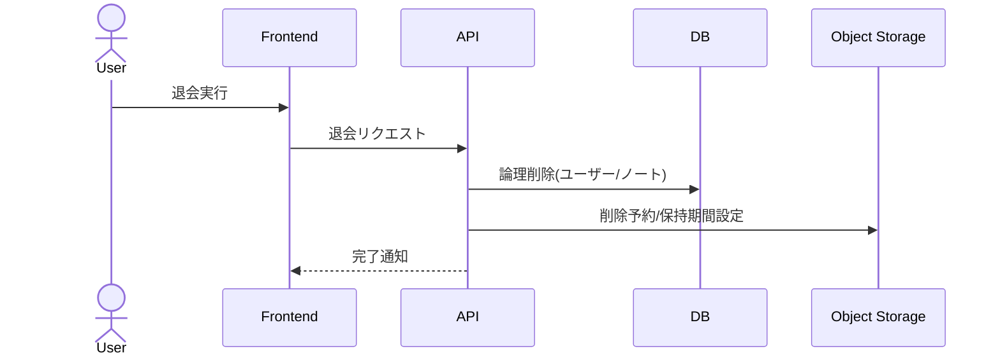

# 主要データフロー

## ログイン → ノート編集 → 自動保存

```mermaid
sequenceDiagram
  actor User
  participant FE as Frontend
  participant API as API
  participant DB as DB
  participant OBJ as Object Storage

  User->>FE: ログイン
  FE->>API: 認証要求
  API->>DB: ユーザー検証
  API-->>FE: セッション確立

  User->>FE: ノート編集
  FE->>API: 変更差分を送信
  API->>DB: メタデータ更新
  API->>OBJ: 本文/本文差分保存
  API-->>FE: 保存状態(保存済み/未保存/失敗)
```

## 検索

```mermaid
sequenceDiagram
  actor User
  participant FE as Frontend
  participant API as API
  participant DB as DB

  User->>FE: 検索キーワード入力
  FE->>API: 検索要求
  API->>DB: インデックス検索
  API-->>FE: 検索結果
```

## PDFエクスポート

```mermaid
sequenceDiagram
  actor User
  participant FE as Frontend
  participant API as API
  participant JOB as Worker
  participant OBJ as Object Storage

  User->>FE: PDFエクスポート
  FE->>API: エクスポート要求
  API->>JOB: ジョブ登録
  JOB->>OBJ: PDF生成/保存
  API-->>FE: 完了通知/ダウンロードURL
```

## 共有リンク閲覧

```mermaid
sequenceDiagram
  actor Guest
  participant FE as Share UI
  participant API as API
  participant DB as DB
  participant OBJ as Object Storage

  Guest->>FE: 共有リンクアクセス
  FE->>API: 共有トークン検証
  API->>DB: トークン/ノート照合
  API->>OBJ: 本文取得
  API-->>FE: 閲覧データ
```

## 退会/削除

```mermaid
sequenceDiagram
  actor User
  participant FE as Frontend
  participant API as API
  participant DB as DB
  participant OBJ as Object Storage

  User->>FE: 退会実行
  FE->>API: 退会リクエスト
  API->>DB: 論理削除(ユーザー/ノート)
  API->>OBJ: 削除予約/保持期間設定
  API-->>FE: 完了通知
```
