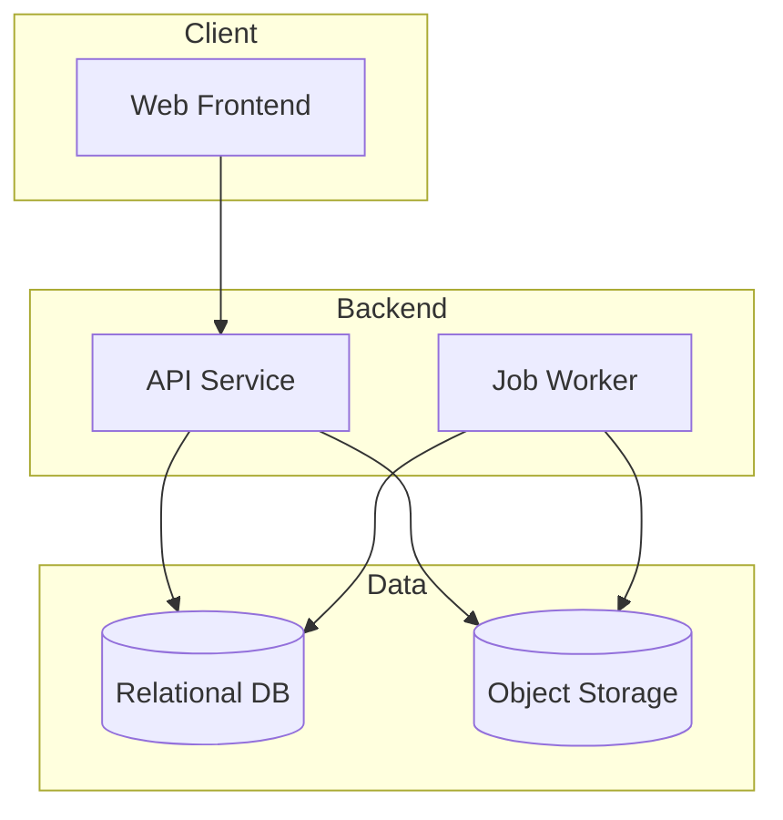

# アーキテクチャ概要（論理）

## 論理構成

```mermaid
flowchart TB
  subgraph Client
    web[Web Frontend]
  end
  subgraph Backend
    api[API Service]
    worker[Job Worker]
  end
  subgraph Data
    db[(Relational DB)]
    obj[(Object Storage)]
  end

  web --> api
  api --> db
  api --> obj
  worker --> db
  worker --> obj
```

## コンポーネント
- Frontend: 認証UI、ノートエディタ、一覧/検索、共有閲覧
- Backend API: 認証、CRUD、検索、共有リンク、エクスポート
- Job Worker: PDF生成、メール送信キュー処理
- DB: メタデータ/権限/インデックス
- Object Storage: ノート本文、PDF、添付
