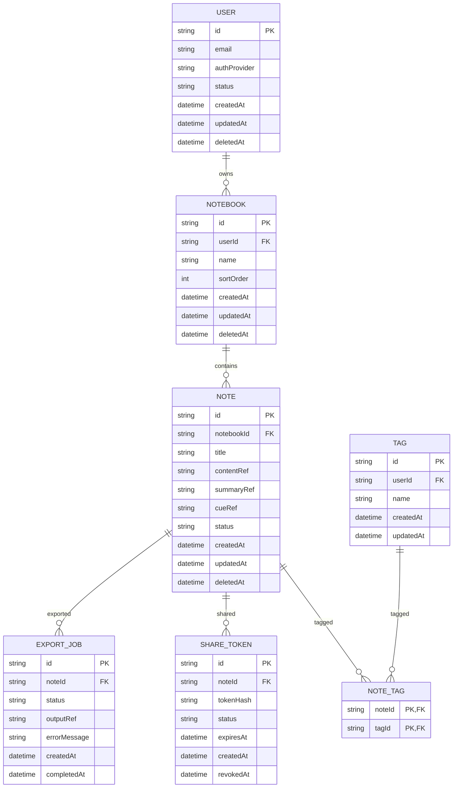

# ERD（概要）

## 状態
- Note.status: draft/active/archived
- ShareToken.status: active/revoked/expired
- ExportJob.status: queued/running/succeeded/failed

## 補足
- contentRef/summaryRef/cueRef はObject Storage参照
- errorMessageは失敗時のみ保存
- NOTE_TAG は noteId + tagId の一意制約を持つ
- TAG は userId + name の一意制約を持つ（同一ユーザー内で同名タグは不可）
