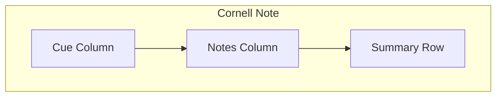

# Cornellレイアウト仕様

## レイアウト構造
- Cue（左カラム）: キーワード/質問
- Notes（中央）: 本文
- Summary（下部）: 要約

## UI要件
- Cue/Notes/Summaryの区切りを明確に表示
- Notesエリアは長文入力に最適化
- Summaryは自動保存対象

## 自動保存UX
- 変更検知後に短い遅延で保存
- 保存状態を表示（FR-017）
  - 保存済み
  - 未保存
  - 失敗（再試行案内）
