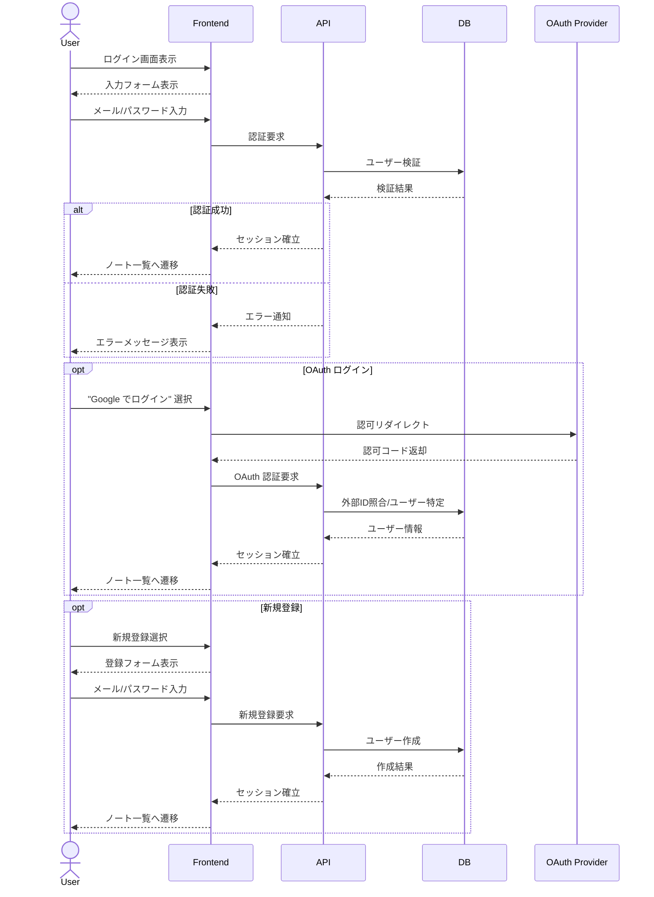

# UC-01 サインアップ／ログイン シーケンス

## 概要
UC-01（サインアップ／ログイン）の詳細シーケンス。

## シーケンス

```mermaid
sequenceDiagram
  actor User
  participant FE as Frontend
  participant API as API
  participant DB as DB
  participant OAuth as OAuth Provider

  User->>FE: ログイン画面表示
  FE-->>User: 入力フォーム表示

  User->>FE: メール/パスワード入力
  FE->>API: 認証要求
  API->>DB: ユーザー検証
  DB-->>API: 検証結果
  alt 認証成功
    API-->>FE: セッション確立
    FE-->>User: ノート一覧へ遷移
  else 認証失敗
    API-->>FE: エラー通知
    FE-->>User: エラーメッセージ表示
  end

  opt OAuth ログイン
    User->>FE: "Google でログイン" 選択
    FE->>OAuth: 認可リダイレクト
    OAuth-->>FE: 認可コード返却
    FE->>API: OAuth 認証要求
    API->>DB: 外部ID照合/ユーザー特定
    DB-->>API: ユーザー情報
    API-->>FE: セッション確立
    FE-->>User: ノート一覧へ遷移
  end

  opt 新規登録
    User->>FE: 新規登録選択
    FE-->>User: 登録フォーム表示
    User->>FE: メール/パスワード入力
    FE->>API: 新規登録要求
    API->>DB: ユーザー作成
    DB-->>API: 作成結果
    API-->>FE: セッション確立
    FE-->>User: ノート一覧へ遷移
  end
```

## 補足
- 認証方式はパスワードログインと OAuth を併用する。
- 例外時は入力画面に留まり、再試行を許可する。
