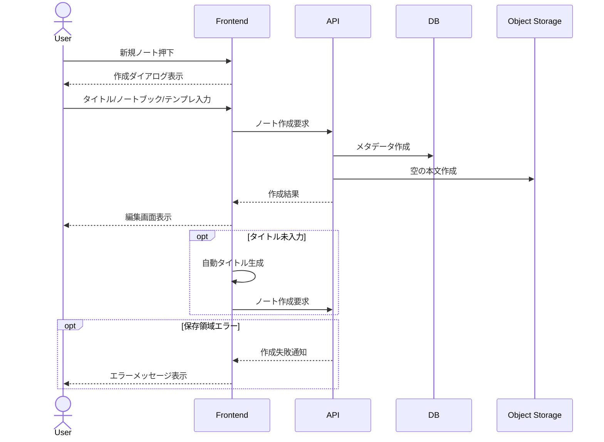

# UC-02 コーネル式ノート作成 シーケンス

## 概要
UC-02（コーネル式ノート作成）の詳細シーケンス。

## シーケンス

```mermaid
sequenceDiagram
  actor User
  participant FE as Frontend
  participant API as API
  participant DB as DB
  participant OBJ as Object Storage

  User->>FE: 新規ノート押下
  FE-->>User: 作成ダイアログ表示
  User->>FE: タイトル/ノートブック/テンプレ入力
  FE->>API: ノート作成要求
  API->>DB: メタデータ作成
  API->>OBJ: 空の本文作成
  API-->>FE: 作成結果
  FE-->>User: 編集画面表示

  opt タイトル未入力
    FE->>FE: 自動タイトル生成
    FE->>API: ノート作成要求
  end

  opt 保存領域エラー
    API-->>FE: 作成失敗通知
    FE-->>User: エラーメッセージ表示
  end
```

## 補足
- Cornell 形式（Cue/Notes/Summary）を初期状態で生成する。
- 作成直後に編集画面へ遷移する。
