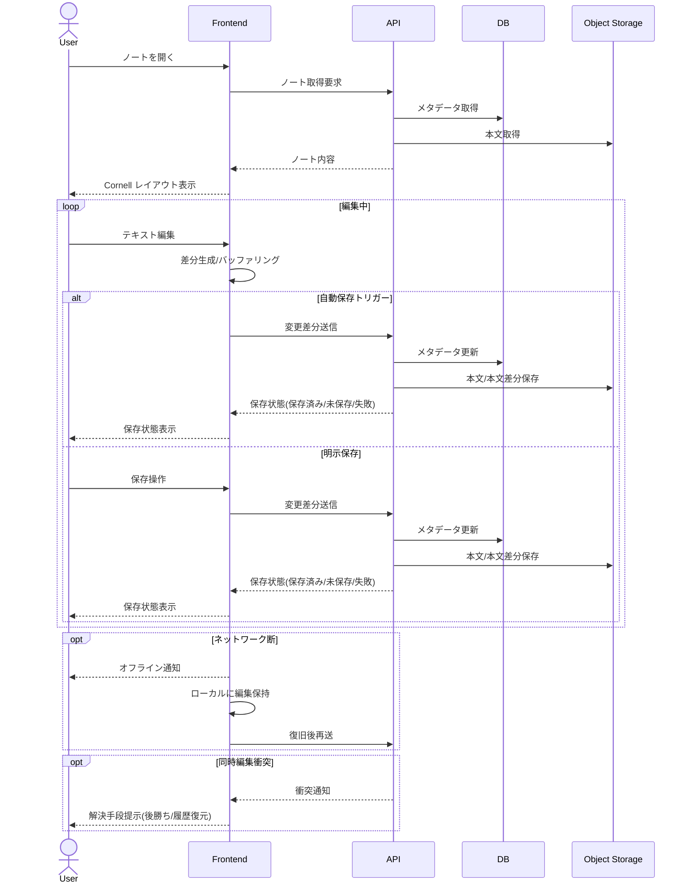

# UC-03 コーネル式ノート編集／自動保存 シーケンス

## 概要
UC-03（コーネル式ノート編集）の詳細シーケンス。

## シーケンス

```mermaid
sequenceDiagram
  actor User
  participant FE as Frontend
  participant API as API
  participant DB as DB
  participant OBJ as Object Storage

  User->>FE: ノートを開く
  FE->>API: ノート取得要求
  API->>DB: メタデータ取得
  API->>OBJ: 本文取得
  API-->>FE: ノート内容
  FE-->>User: Cornell レイアウト表示

  loop 編集中
    User->>FE: テキスト編集
    FE->>FE: 差分生成/バッファリング
    alt 自動保存トリガー
      FE->>API: 変更差分送信
      API->>DB: メタデータ更新
      API->>OBJ: 本文/本文差分保存
      API-->>FE: 保存状態(保存済み/未保存/失敗)
      FE-->>User: 保存状態表示
    else 明示保存
      User->>FE: 保存操作
      FE->>API: 変更差分送信
      API->>DB: メタデータ更新
      API->>OBJ: 本文/本文差分保存
      API-->>FE: 保存状態(保存済み/未保存/失敗)
      FE-->>User: 保存状態表示
    end
  end

  opt ネットワーク断
    FE-->>User: オフライン通知
    FE->>FE: ローカルに編集保持
    FE->>API: 復旧後再送
  end

  opt 同時編集衝突
    API-->>FE: 衝突通知
    FE-->>User: 解決手段提示(後勝ち/履歴復元)
  end
```

## 補足
- 自動保存は編集差分ベースで送信する。
- 保存状態は「保存済み/未保存/失敗」を UI に反映する。
