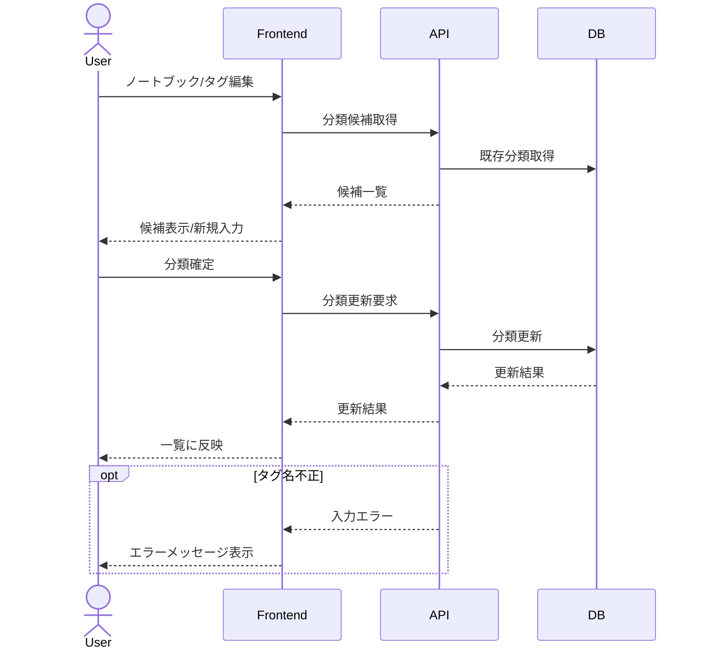

# UC-04 ノート整理（ノートブック／タグ）シーケンス

## 概要
UC-04（ノート整理）の詳細シーケンス。

## シーケンス

```mermaid
sequenceDiagram
  actor User
  participant FE as Frontend
  participant API as API
  participant DB as DB

  User->>FE: ノートブック/タグ編集
  FE->>API: 分類候補取得
  API->>DB: 既存分類取得
  API-->>FE: 候補一覧
  FE-->>User: 候補表示/新規入力

  User->>FE: 分類確定
  FE->>API: 分類更新要求
  API->>DB: 分類更新
  DB-->>API: 更新結果
  API-->>FE: 更新結果
  FE-->>User: 一覧に反映

  opt タグ名不正
    API-->>FE: 入力エラー
    FE-->>User: エラーメッセージ表示
  end
```

## 補足
- タグ/ノートブックの新規作成を許可する。
- 禁則文字や長さ制限は入力バリデーションで処理する。
