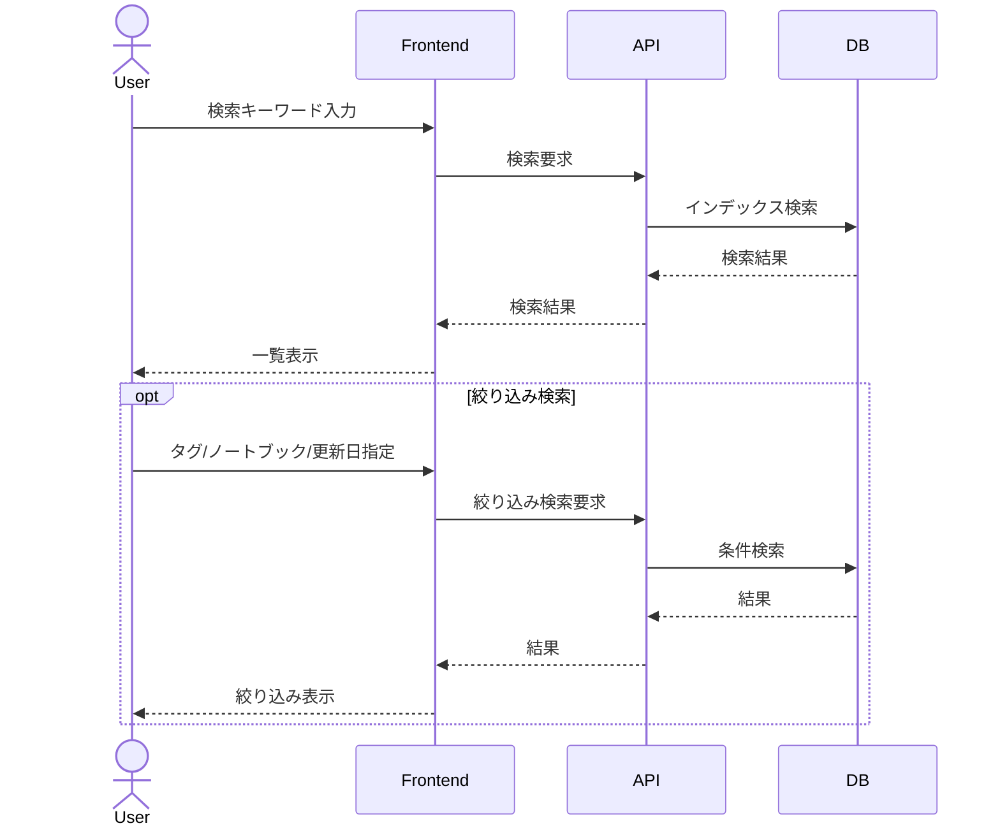

# UC-05 ノート検索 シーケンス

## 概要
UC-05（ノート検索）の詳細シーケンス。

## シーケンス

```mermaid
sequenceDiagram
  actor User
  participant FE as Frontend
  participant API as API
  participant DB as DB

  User->>FE: 検索キーワード入力
  FE->>API: 検索要求
  API->>DB: インデックス検索
  DB-->>API: 検索結果
  API-->>FE: 検索結果
  FE-->>User: 一覧表示

  opt 絞り込み検索
    User->>FE: タグ/ノートブック/更新日指定
    FE->>API: 絞り込み検索要求
    API->>DB: 条件検索
    DB-->>API: 結果
    API-->>FE: 結果
    FE-->>User: 絞り込み表示
  end
```

## 補足
- タイトル/Cue/Notes/Summary/タグを対象に検索する。
- 絞り込み条件は API にフィルタとして渡す。
