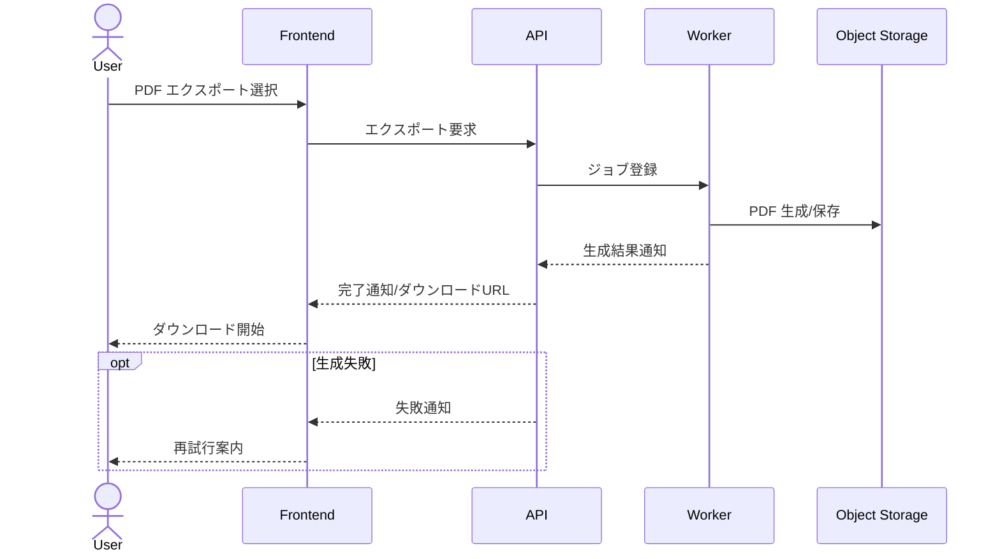

# UC-06 PDF エクスポート シーケンス

## 概要
UC-06（PDF エクスポート）の詳細シーケンス。

## シーケンス

```mermaid
sequenceDiagram
  actor User
  participant FE as Frontend
  participant API as API
  participant JOB as Worker
  participant OBJ as Object Storage

  User->>FE: PDF エクスポート選択
  FE->>API: エクスポート要求
  API->>JOB: ジョブ登録
  JOB->>OBJ: PDF 生成/保存
  JOB-->>API: 生成結果通知
  API-->>FE: 完了通知/ダウンロードURL
  FE-->>User: ダウンロード開始

  opt 生成失敗
    API-->>FE: 失敗通知
    FE-->>User: 再試行案内
  end
```

## 補足
- PDF 生成は非同期ジョブで行う。
- 完了後にダウンロード URL を返す。
