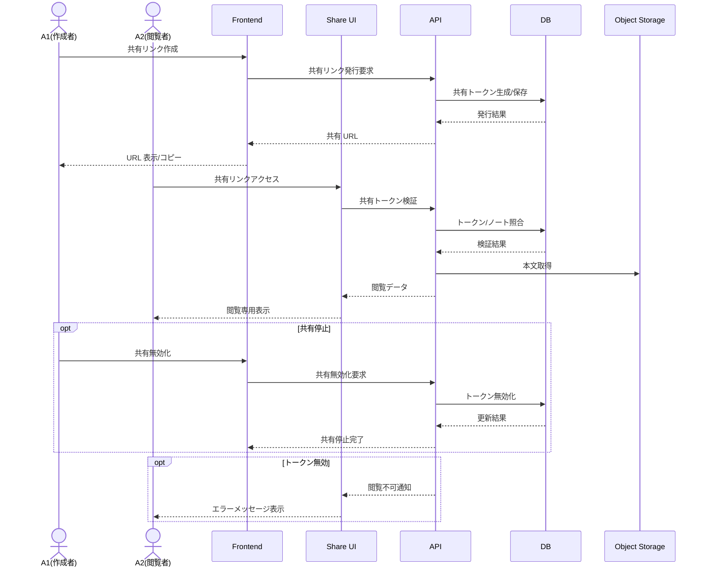

# UC-07 共有リンク閲覧 シーケンス

## 概要
UC-07（共有リンクで閲覧共有）の詳細シーケンス。

## シーケンス

```mermaid
sequenceDiagram
  actor Owner as A1(作成者)
  actor Guest as A2(閲覧者)
  participant FE as Frontend
  participant ShareUI as Share UI
  participant API as API
  participant DB as DB
  participant OBJ as Object Storage

  Owner->>FE: 共有リンク作成
  FE->>API: 共有リンク発行要求
  API->>DB: 共有トークン生成/保存
  DB-->>API: 発行結果
  API-->>FE: 共有 URL
  FE-->>Owner: URL 表示/コピー

  Guest->>ShareUI: 共有リンクアクセス
  ShareUI->>API: 共有トークン検証
  API->>DB: トークン/ノート照合
  DB-->>API: 検証結果
  API->>OBJ: 本文取得
  API-->>ShareUI: 閲覧データ
  ShareUI-->>Guest: 閲覧専用表示

  opt 共有停止
    Owner->>FE: 共有無効化
    FE->>API: 共有無効化要求
    API->>DB: トークン無効化
    DB-->>API: 更新結果
    API-->>FE: 共有停止完了
  end

  opt トークン無効
    API-->>ShareUI: 閲覧不可通知
    ShareUI-->>Guest: エラーメッセージ表示
  end
```

## 補足
- 共有リンクは閲覧専用で編集不可。
- 共有停止後はトークンを無効化する。
