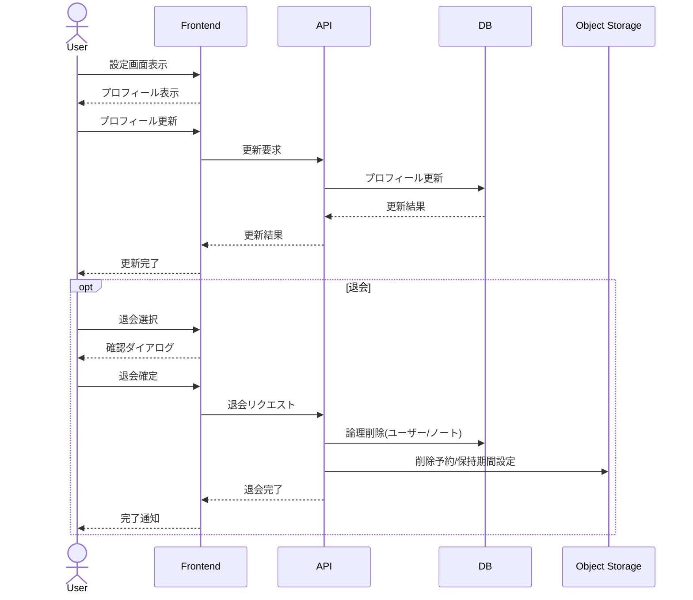

# UC-08 アカウント管理 シーケンス

## 概要
UC-08（アカウント管理）の詳細シーケンス。

## シーケンス

```mermaid
sequenceDiagram
  actor User
  participant FE as Frontend
  participant API as API
  participant DB as DB
  participant OBJ as Object Storage

  User->>FE: 設定画面表示
  FE-->>User: プロフィール表示

  User->>FE: プロフィール更新
  FE->>API: 更新要求
  API->>DB: プロフィール更新
  DB-->>API: 更新結果
  API-->>FE: 更新結果
  FE-->>User: 更新完了

  opt 退会
    User->>FE: 退会選択
    FE-->>User: 確認ダイアログ
    User->>FE: 退会確定
    FE->>API: 退会リクエスト
    API->>DB: 論理削除(ユーザー/ノート)
    API->>OBJ: 削除予約/保持期間設定
    API-->>FE: 退会完了
    FE-->>User: 完了通知
  end
```

## 補足
- 退会処理は論理削除とし、保持期間を設ける。
- 退会後はセッションを無効化する。
